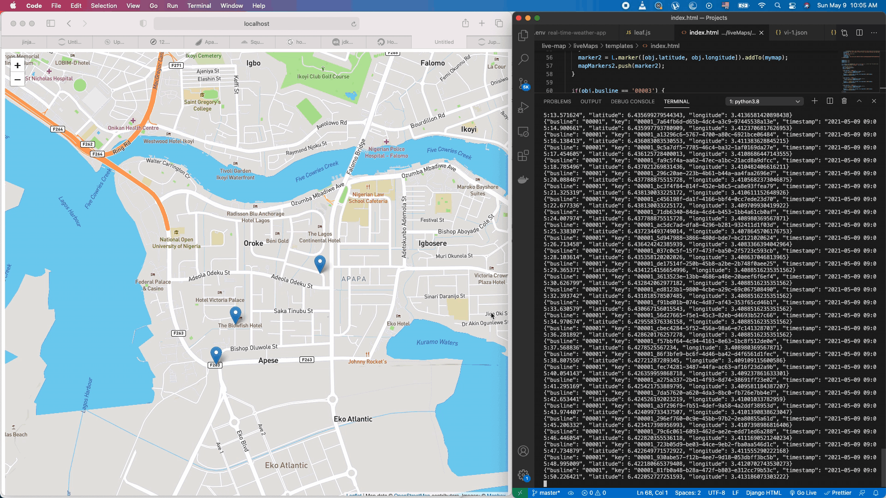

# Delivery Vehicle Tracker

The delivery vehicle tracker tracks three delivery vehicles that deliver around Victoria Island Lagos, Nigeria. The simulated coordinates are passed to a pykafka producer which then passes the data to kafka broker running in a docker container on a google cloud virtual machine. The data is then consumed by a flask web app with leaflet.js displaying the map.




### Broker Setup Using Docker

* Prerequisite
  - Install Docker
  - Install Docker-compose

* Run Kakfa and Zookeeper Container. You can check a docker-compose template [here](https://github.com/conduktor/kafka-stack-docker-compose)
* Create a kafka topic for the vehicle tracker
  - Use `docker ps` to get the name of the Kafka container
  - Use the command `docker exec -it <container name> /bin/bash` to get a bash shell in the container
  
    

  ``` 
  \# Run this command to create a topic
  Kafka-topics --zookeeper <zookeeper-container-name:port> --topic <topic name> --create --partitions <number> --replication-factor <number> 
  ```


### Run Application

* Update the .env file 
  ```
  host=hostaddress:port
  topic=topic-name
  ```

* Install Dependencies
  ```
  pip install -r requirements.txt
  ```

* Start Producers
  ```
  python busdata1.py
  python busdata2.py
  python busdata3.py

  ```


* Start Web App
  ```
  python app.py
  ```
